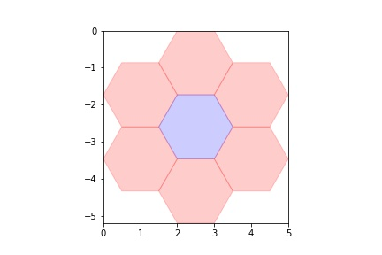

# Genetic Algorithms with Python

Genetic algorithms are metaheuristics inspired in the process of natural selection. They are useful in problems regarding the search of non-optimal but sufficiently good solutions to problems involving large search spaces.

In this notebook, I will showcase a simple optimization problem, and find a solution through a genetic algorithm using the Python library PyGAD

<!-- #region raw_mimetype="text/html" -->
## About the problem

The problem we'll be solving is the following: 

Given a hexagon grid (Hexgrid for short) which has a certain amount of empty slots, we are asked to paint each cell with one of three colours: red, blue or green. Our colour selection is then scored following these guidelines:

- Each cell has a given colour-score, which is one plus the number of same-colour cells touching it. This way, cell 1 has blue-score 7 and cell 2 has blue-score 1.


|Cell 1 | Cell2 |
|:-------------------------:|:-------------------------:|
|  |  |

- Total colour-scores are summed up separately, giving a red-score total, blue-score total and green-score total.
- The final score is the minimum of said colour scores.

Our goal now is to automate the solving process to guarantee a good enough solution to any such hexgrid. We are going to do so by means of a genetic algorithm.
<!-- #endregion -->

## Solving the problem


### Automation of some steps

Before we start solving the problem, we are going to need some libraries and some functions to automate the tiling creation, plotting, and some calculations needed to solve the problem

```python id="VJ6oANVu-mG4"
# Here we load some libraries

import numpy as np #Needed for optimal computing
import pygad #Implements genetic algorithm
import matplotlib.pyplot as plt #Needed to plot the tiling creation
from matplotlib.patches import RegularPolygon #Needed to plot hexagonal tiles
```

```python id="9IMXh1r8OTFC"
#Here we automate the creation of a given hexgrid, and the computing of some matrices needed for the problem

def creatematrix(xmax,ymax,p=[0.4,0.6]):
    #We create a random matrix of ones an zeros. This way we obtain a representation of the hexgrid in the form of a matrix.
    mat = np.reshape(np.random.choice(np.arange(0, 2),size=ymax*xmax, p=p),(xmax,ymax))
    #We clean some points in the matrix which do not represent any tiles
    for i in range(xmax):
        for j in range(ymax):
            if (i+j)%2==0:
                mat[i,j]=0

    #We assign an id to each hex tile in the matrix
    mat = asigna_id(mat)

    #We return both matrixes
    return mat

#This function creates an alternative matrix which assigns an id to each hex tile
def asigna_id(mat):
    shape = mat.shape
    flat = mat.flatten()
    ids = np.where(flat==1)[0]
    flat[ids]=np.arange(len(ids))+1
    return flat.reshape(shape)


```

```python id="F_ny80PfQ6nb"
#Computing an adjacency matrix is necessary for this problem. These functions automate the process

def buildAdjMatrix(mat):
    numnodes = mat.max()
    
    #Padding is needed to perform some calculations
    matPadded = np.pad(mat,2)
    
    #This line calculates the adjacency vector of each hex tile 
    #Adjacency vector: a one an zero vector where one indicates that the hex tile with id=one's position is connected to said tile
    adjMat = [creaVectorAdj(id,matPadded,numnodes) for id in range(numnodes)]
    
    #We transform the list of arrays into an array and get the adjacency matrix.
    adjMat = np.array(adjMat).astype(int)
    return adjMat

#This function calculates the adjacency vector to a given tile
def creaVectorAdj(id,matPadded,numnodes):
    id = id+1
    connexIds = connectedTo(id,matPadded)
    zeros = np.zeros(numnodes)
    zeros[connexIds]=1
    return zeros

#Since our matricial representation of a hex grid is a bit complicated, this function gets the ids of the hex tiles adjacent to a given tile
def connectedTo(id,matPadded):
    coordx,coordy = np.where(matPadded==id)[0][0], np.where(matPadded==id)[1][0]
    frame = np.copy(matPadded[coordx-2:coordx+3,coordy-1:coordy+2])
    frame[2,1]=0
    connected = frame[np.nonzero(frame)]
    return connected-1


```

```python id="mR7zVImUn9uS"
#Plotting functions

#This function plots a hexgrid based on its id matrix. It allows colouring if a colorcode vector is given. Colors can also be set, if not, they are selected randomly.
#A color vector is an int vector where a value indicates a color, and its position the cell which it refers to.
def dibujaMat(mat,colorcode = None,colores=None):
    centros = [calculaCoord(y,x) for (x,y) in zip(np.where(mat>0)[0],np.where(mat>0)[1])]
    xmax = max([x for (x,y) in centros])+1
    ymin = min([y for (x,y) in centros])-np.sqrt(3)/2
    fig, ax = plt.subplots(1)
    ax.set_aspect('equal')
    ax.set_xlim(0,xmax)
    ax.set_ylim(ymin,0)
    if colorcode is not None:
        unicos = np.unique(colorcode)
        if colores is None or len(colores)!= len(unicos):
            colores = [np.random.rand(3,) for i in range(len(unicos))]
        dicColores = dict(zip(unicos,colores))
        colorcode = [dicColores[k] for k in colorcode]

        for (coordenada,color) in zip(centros,colorcode):
          hex = RegularPolygon(coordenada, numVertices=6, radius=1, 
                              orientation=np.radians(30), 
                              facecolor='Black', alpha=0.2, edgecolor='k', color=color)
          ax.add_patch(hex)
    else:
        for coordenada in centros:
          hex = RegularPolygon(coordenada, numVertices=6, radius=1, 
                              orientation=np.radians(30), 
                              facecolor='Black', alpha=0.2, edgecolor='k')
          ax.add_patch(hex)
    plt.show()

#This function calculates the position of a hex tile on the Cartesian surface given by its position in the id matrix
def calculaCoord(coordX,coordY):
    x=1+coordX*1+0.5*coordX
    y=-np.sqrt(3)/2-coordY*np.sqrt(3)+np.sqrt(3)/2*coordY
    return (x,y)
```

### Creating and plotting the hex grid

Now, let's create a hex grid and take a look at it. We will take a maximum width and maximum height of 25 tiles.

```python
ymax,xmax = 25,25

mat = creatematrix(xmax,ymax)
dibujaMat(mat)
```


We can see the grid has some chunks of fully connected hex tiles which are separated by small chunks of void. Deciding the colors by hand may be tough, but luckyly we are not doing that.

Once the hex grid has been created, we must build its adjacency matrix:

```python colab={"base_uri": "https://localhost:8080/"} id="ieBvezzH_JgY" outputId="e62b3ac3-28a7-4378-884c-a635e92e2b64"
matAdj = buildAdjMatrix(mat)
```

### Creating the genetic algorithm instance

In order to create a genetic algorithm using PyGAD, we need to define a genetic representation of a solution and a fitness function function for each solution (that is, a way of computing how good is each solution generated by the algorithm). We also need to select some parameters.

Our genetic representation of a solution will be a color vector: an int vector where a value (in this case 0, 1 or 2) indicates a color, and its position the id of the cell which it refers to.
As for the fitness function, it is implemented in the following cell:

```python id="ZxbbxP1k_Oi5"
#This function calculates the total score of each solution
def fitness(sol,id):
    #We calculate the color score for each color
    scores = np.array([score(num,sol) for num in np.arange(0,3)])
#     base = matAdj.shape[0]/(max-min)
    #We get and return the minimum of the 3 values
    minimo = np.min(scores)#/base
    return minimo

#This function picks the cells with color equal to num and calculates the color score
def score(num,sol):
    indices = np.where(sol==num)[0]
    adjacencia = fastmatrix(matAdj,indices)
    return adjacencia + len(indices) 

#Usually the adjacency score would be calculated through matrix multiplication, but with this function the process is 4x faster
def fastmatrix(matAdj,ind):
    return np.sum(matAdj[np.ix_(ind,ind)])
    
```

Once the fitness function is implemented, we must create the Genetic Algorithm (GA) instance. I added a callback function which allows us to see the score of the best solution of each generation during training

```python
def callback_gen(ga_instance):
    print("Generation : ", ga_instance.generations_completed)
    print("Fitness of the best solution :", ga_instance.best_solution()[1])
```

```python colab={"base_uri": "https://localhost:8080/"} id="upEpUsOSHJDK" outputId="f2e14ba6-5735-4d4e-c3c9-bd5853bd1013"
#We create the GA instance. Each parameter is explained below

pygad_GA = pygad.GA(num_generations=1000, #Number of generations the GA is going to go through
                    num_parents_mating=250, #Number of parents mating for each generation, the rest are discarded.
                    crossover_type='scattered', #Method of parent mating. Scattered means each gene is randomly chosen from one of the parents
                    keep_parents=250, #We keep all of the parents in each generation. This ensures score doesn't drop
                    fitness_func=fitness, #We pass our fitness function to the GA instance
                    sol_per_pop=2500, #Number of solutions per generation. 
                    num_genes=int(mat.max()), #Length of the colour vector. It equals the highest id of the representation matrix.
                    gene_type=int, #Type of value of the genes in the colour vector. 
                    mutation_type='random', #Method of mutation. Random means genes may be flipped to another allowed int value.
                    mutation_percent_genes=10, #Percentage of genes which will be flipped in each mutation
                    on_generation=callback_gen #We pass the callback function to the GA instance.
                   )

#We initialize the population for the GA instance
pygad_GA.initialize_population(low=0, #Lowest value possible for each gene
                               high=3, #Highest value possible for each gene
                               allow_duplicate_genes=True, #This options allows repeated values in the representation
                               mutation_by_replacement=True, #How the new value obtained from random mutation is applied. If not set to True, the random value would be added to the current value of the gene.
                               gene_type=int #We make sure initialized values are integers.
                              )
```

### Run it!

Once everything is built and working, we run the Genetic Algorithm.

```python colab={"base_uri": "https://localhost:8080/"} id="dQzwjffE_C0T" outputId="f31e5fb8-4e38-4502-a139-285bdf2bc017"
pygad_GA.run() #Output was removed due to its length
```

### Analysis of the solution

Now that the process is over, let's rehearse how the score evolved along the 1000 generations:

```python
pygad_GA.plot_fitness()
```


As we can see, the best solutions quickly reached a score of around 320, and barely improved from that point onwards. This is pretty common for this problem, although for larger grids local maxima are usual, so optimal solutions are not guaranteed.

Finally, let's plot the solution:

```python id="7dOoWo_D-oeW"
colorvector = pygad_GA.best_solution()[0]
dibujaMat(mat,colorvector,colores=['red','blue','green'])
```


As we can see, each colour is grouped on a given region, although some isolated red cells can be seen. Clearly, this is not the best possible solution to the problem, but it is fairly good, and has been found automatically.
